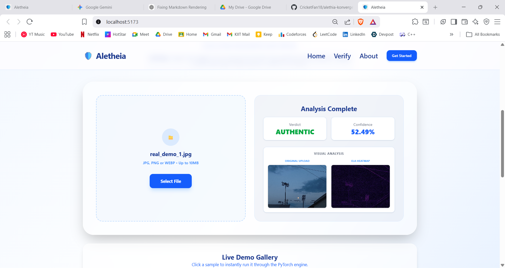
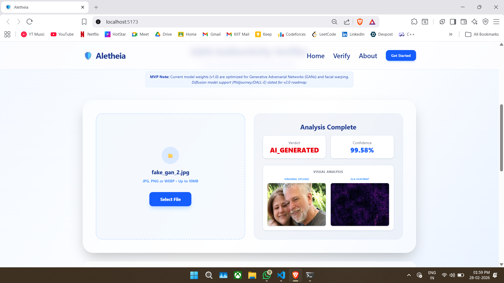
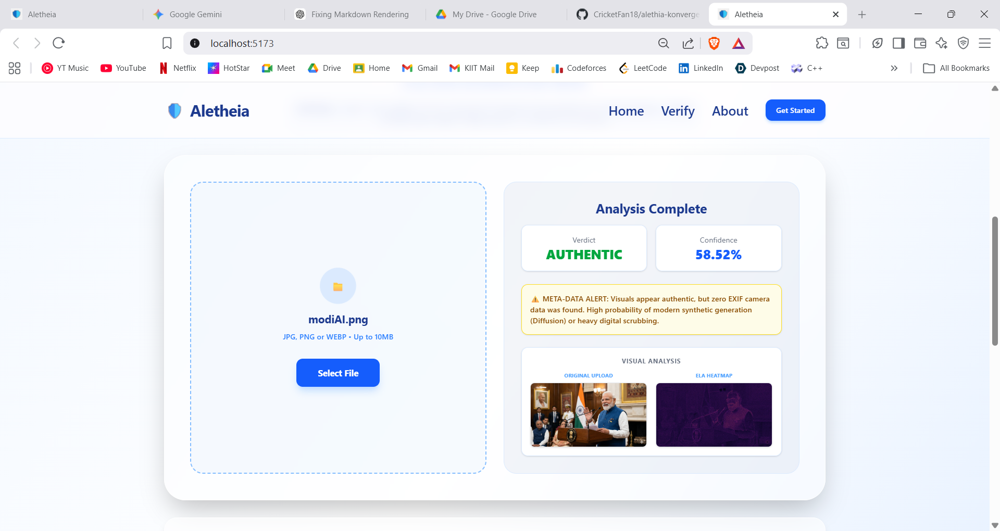

# 🛡️ Aletheia

**Aletheia** is an end-to-end system designed to detect pixel-level facial warping, Deepfake artifacts, and Generative Adversarial Network (GAN) manipulations. 

This project goes beyond simple binary classification by providing a "Core System Logic" that generates visual and structural evidence (ELA Heatmaps and EXIF Metadata extraction) to verify image authenticity.

## 🚀 Features & Scope (v1.0 MVP)

* **Pixel-Level Analysis:** Model weights are highly optimized for detecting Generative Adversarial Networks (GANs) and facial manipulations.
* **The Metadata Shield:** Synthetic images (like those from Midjourney or DALL-E) often strip camera metadata. If zero metadata is found, the system acts as a fail-safe, flagging a **High Probability of Synthetic Origin** even if the visual model predicts authenticity.
* **Visual Proof Generation:** Generates Error Level Analysis (ELA) heatmaps to highlight manipulated regions of an image.
* **Structured Evidence:** Returns a comprehensive JSON payload containing the prediction label, confidence score, ELA heatmap, and extracted EXIF data.

> **MVP Limitations:** Current model weights (v1.0) are optimized for Generative Adversarial Networks (GANs). Full diffusion model support (Midjourney/DALL-E) is slated for v2.0.

## 📸 Visual Proof

*(Replace the bracketed paths below with the actual paths to your images, e.g., `assets/screenshot1.png`)*

*Caption: Clean, user-friendly interface for uploading and analyzing suspect media.*

*Caption: System successfully verifying an authentic image alongside extracted EXIF metadata.*

*Caption: Highlighting Deepfake and GAN manipulation using Error Level Analysis (ELA) heatmaps.*

*Caption: The Metadata Shield UI warning triggering on a diffusion-generated image.*

## 🏗️ System Architecture

### 1. Machine Learning Pipeline
* **Dataset:** Custom Kaggle dataset containing Real and AI-generated images.
* **Preprocessing:** Handled via `PyTorch Transforms`.
* **Model:** `EfficientNet-B0` fine-tuned with Binary Cross-Entropy (BCE) Loss.
* **Output:** Generates `base_model.pth` for backend inference.

### 2. Backend (FastAPI)
* **Framework:** FastAPI for high-performance, asynchronous endpoints.
* **Endpoint:** `POST /api/analyze` accepts `FormData` containing the image.
* **Inference Pipeline:** Preprocesses the image -> runs through `base_model.pth` -> applies a Sigmoid function for probability scoring.
* **Evidence Generation:** Simultaneously extracts EXIF metadata and computes the ELA Heatmap.

### 3. Frontend (React)
* **Interface:** User-friendly React UI for image uploads.
* **Validation:** Client-side checks for file type and size limits before API requests.
* **Result Rendering:** Dynamically displays the authenticity label, confidence score, visual ELA heatmap, and metadata logs. 
* **Smart Warnings:** Automatically triggers a bright UI warning (`⚠️ WARNING: Zero Metadata Found. High Probability of Synthetic Origin.`) if EXIF data is missing, effectively catching diffusion-generated images.

## 📊 Model Evaluation (EfficientNet-B0)

The current model was evaluated on a testing split of real and fake (GAN-generated) images. Below is the performance breakdown based on our Confusion Matrix:

| Actual \ Predicted | Predicted Fake | Predicted Real |
| :--- | :--- | :--- |
| **Actual Fake** | 4,353 (True Positives) | 1,139 (False Negatives) |
| **Actual Real** | 2,148 (False Positives) | 3,265 (True Negatives) |

* **Total Images Evaluated:** 10,905
* **Overall Accuracy:** ~69.8% 
* *Note: False Negatives from advanced diffusion models are currently mitigated in the UI layer via our EXIF Metadata Shield logic.*

## 💻 Tech Stack

* **Frontend:** React.js
* **Backend:** FastAPI, Python
* **Machine Learning:** PyTorch, EfficientNet, OpenCV (for ELA), Pillow (for EXIF)

## 👥 Team Details

**Team Name:** OverCooked6.9

* **Vivek Kesarwani** – Machine Learning & Backend Integration
* **Samira Khan** – Data Preprocessing & Presentation
* **Abhineet Sahay** – Frontend Architecture & UI/UX